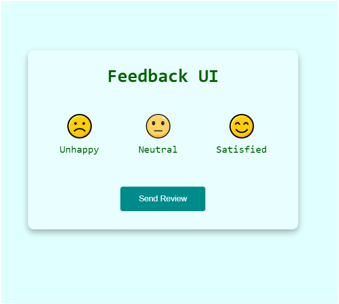

# OverView
The purpose of making this small feedBack is to get the idea about how it actually works.
And we can use it in e-commerce webistes or those website which is builted for targeting
the big   audience and taking their feedBack and improving by it. This a a great thing.
<b>To Improve </b> 

## FeeBack UI 
Well this is the code that i write from my self after watching the real code form the 100-js-projects. There are plenty of mini-Projects from where you can grab a greate ideas.

## Description of FeedBack UI 
It is main focus to get the feedback of the customer how they feel about the products.
It is  a great way to know does the peoples like our products or not. 

## Demo/ScreenShot

## Langauges used to built this 
1. Html
2. css
3. javaScript

### Process to make it 
1. create a html file and import the image icon and insert a text by using the semantic tag of small  & strong. 

2. create a css file and make it flex and arrange to it to the center. and add the Active state class and add some styles. I have used the external https links to take a icons from the webBrowsers. 

3. create a javaScript file and Import the elements to the variables in the Js and make a intialValue = "";
and use it to store the value. use the forEach methods to go the loop through methods and append the classList of active and make a of buttons when it's click it will show the output and remove the emoji. and show the output. At last create a function of the removeActive() and remove active state when click other emoji. 

## Code Links
github - ()
You can see a code and recognize it 

### Author & Built Date
- Vim Magar
- 2025/4/16 
- Day : WednesDay